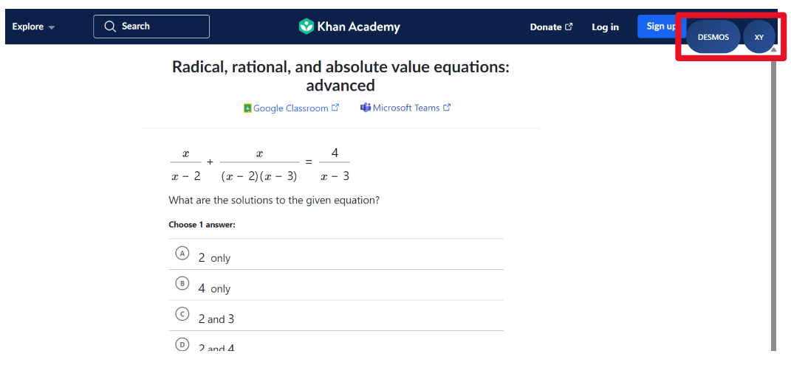
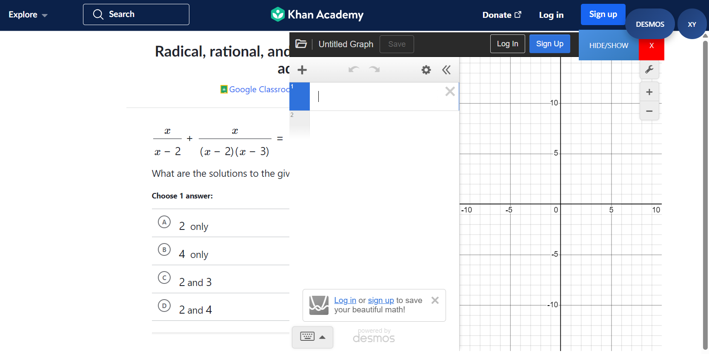
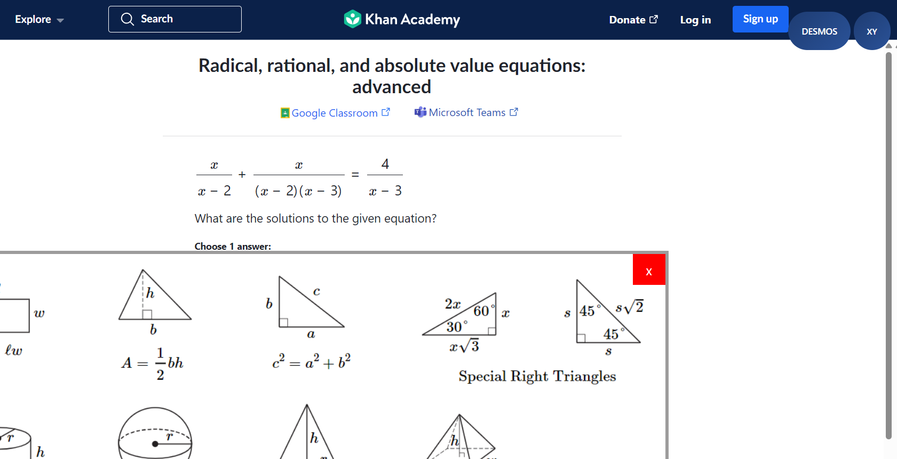

## SAT Math Toolbar (extension)

when I was practicing for the SAT, I always found it annoying to switch tabs - one for desmps, another for the formula sheet - while trying to stay focused on the problem. now, as an online tutor, i see my students running into the exact same issue. it feels weird telling them to hop between windows when the real test keeps everything in one place.

so i made this extension - it puts the tools (desmos graphing calculator and ref sheet) right there ton top of the screen on the same page - no more switching tabs and you can practice in the same flow and format as you'll see on the test day.

### how to use
1. download the zip/clone the repo
2. go to extensions, load unpacked
3. select the folder, and refresh
4. go to khan academy sat math practice and you should be able to see the extension in action