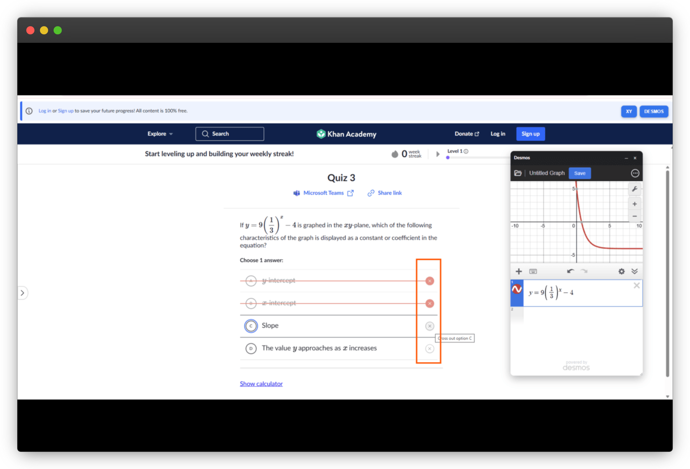
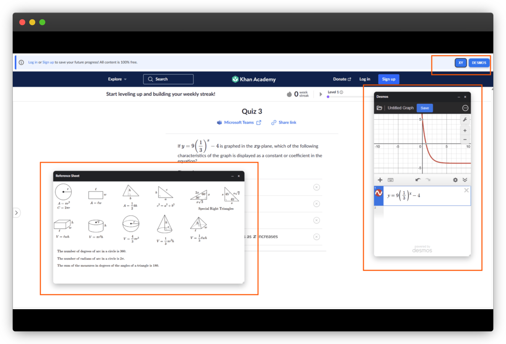
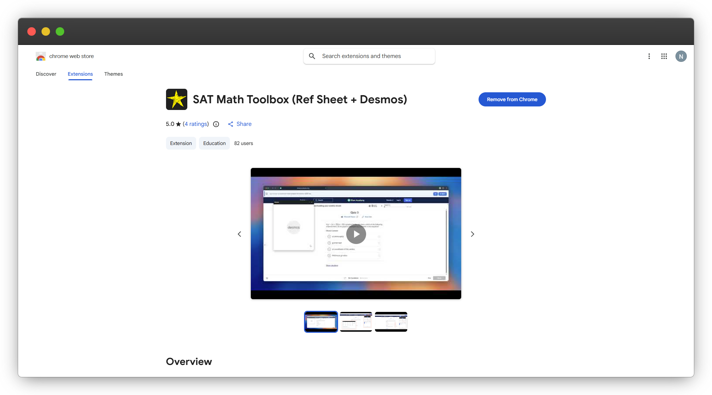

## SAT Math Toolbox Chrome Extension

[](https://chromewebstore.google.com/detail/sat-math-toolbox-ref-shee/hkflbpkbhdlhikfbophoenepogkpklnf)
[](https://chromewebstore.google.com/detail/sat-math-toolbox-ref-shee/hkflbpkbhdlhikfbophoenepogkpklnf)
[](https://chromewebstore.google.com/detail/sat-math-toolbox-ref-shee/hkflbpkbhdlhikfbophoenepogkpklnf)

I tutor SAT math online, and the tab-juggling was driving me (and my students) crazy - one tab open for Desmos, another for the formula sheet, and the actual practice problem somewhere in between. on the real digital SAT, everything is right there on the same screen. so I kept telling kids "just open another tab" knowing full well that's not how it works on test day. felt wrong.

so I built this. it's a Chrome extension that puts Desmos and the reference sheet directly on top of Khan Academy's SAT practice — floating, draggable windows that stay out of your way until you need them. practice the way the test actually feels.

---



---

### features

- **Desmos calculator** — floating, resizable window you can drag anywhere on screen. stays on top of the problem so you never lose your place
- **Reference sheet** — the official SAT math formula sheet, one click away, also draggable and resizable
- **Answer elimination** — cross out answer choices just like on the real digital SAT. click ✕ next to any option to strike it, click again to undo
- **Window memory** — positions and sizes are saved between sessions so your layout is always where you left it
- **Active window focus** — whichever window you click automatically comes to the front



---

### install

**→ [Add to Chrome](https://chromewebstore.google.com/detail/sat-math-toolbox-ref-shee/hkflbpkbhdlhikfbophoenepogkpklnf)**

then go to [Khan Academy SAT math practice](https://www.khanacademy.org/test-prep/digital-sat) — the toolbar appears in the top-right corner automatically.



**or run it locally:**
1. clone the repo or download the zip
2. go to `chrome://extensions` and enable Developer Mode
3. click "Load unpacked" and select the folder
4. refresh Khan Academy — toolbar shows up in the top right

---

### project structure

```
sat-math-toolbox/
├── content.js          # toolbar, floating windows, drag/resize/persistence
├── crossout.js         # answer choice elimination
├── styles.css          # styling
├── manifest.json       # Chrome extension config
├── image.png           # SAT math reference sheet
└── icons/              # extension icons
```
